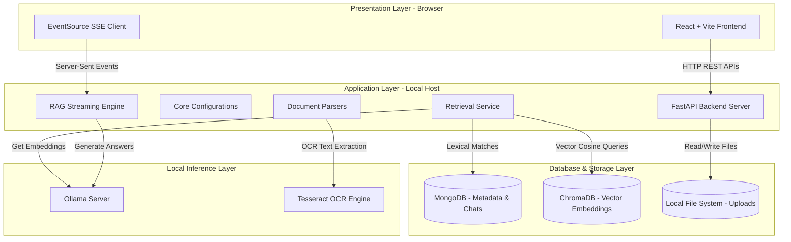
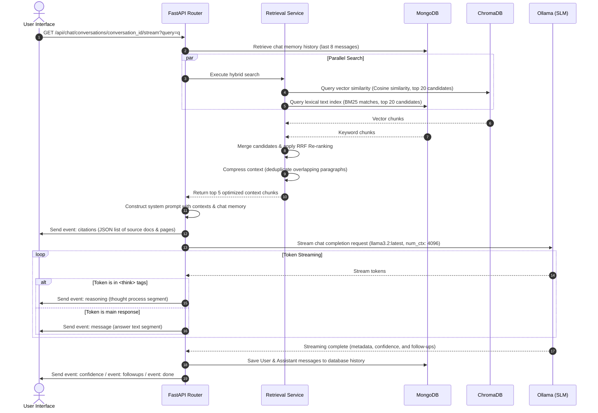

# Local AI Knowledge Studio - System Architecture

This document describes the high-level system architecture of the **Local AI Knowledge Studio**. It outlines the core layers, components, data flows, and interactions between the frontend, backend, database systems, and local AI engines.

---

## 🗺️ 1. High-Level System Architecture

The application is structured into a classic multi-tier architecture, designed to run 100% locally on a single machine without any cloud dependencies.



---

## 🔄 2. Document Ingestion Pipeline (Upload & Indexing)

This flow diagram illustrates how raw documents are transformed into indexed vector and lexical representations.

```mermaid
sequenceDiagram
    autonumber
    actor User as User Interface
    participant API as FastAPI Backend
    participant FS as Local File System
    participant PAR as Document Parser
    participant TES as Tesseract OCR
    participant EMB as Embedding Service (Ollama)
    participant MDB as MongoDB
    participant CDB as ChromaDB

    User->>API: Upload File (with workspace_id)
    API->>FS: Save raw file to uploads/workspace_id/
    API->>MDB: Create Document Record (status: pending)
    API-->>User: Return 200 OK (Starts background task)
    
    Note over API,CDB: Background Indexing Starts
    API->>PAR: Trigger parse(file_path, file_type)
    alt Scanned PDF or Image
        PAR->>TES: Run Optical Character Recognition
        TES-->>PAR: Return extracted OCR text
    else Standard Text (PDF/Docx/Txt/Excel)
        PAR-->>PAR: Parse text page-by-page
    end
    PAR-->>API: Return page texts + document metadata
    
    API->>API: Split page texts into semantic chunks (size: 2400 char, overlap: 500)
    
    loop For each chunk
        API->>MDB: Check if chunk hash exists (cache lookup)
        alt Cache Hit
            MDB-->>API: Return cached chunk ID
            API->>CDB: Retrieve cached vector representation
        else Cache Miss
            API->>EMB: Generate Embedding (mxbai-embed-large)
            EMB-->>API: Return 1024-dimension vector array
        end
    end

    API->>CDB: Insert vector embeddings + page metadata
    API->>MDB: Insert text chunks + page mappings
    API->>MDB: Update Document status to 'completed'
```

---

## 💬 3. Chat Assistant RAG Flow (Query & Stream)

This sequence diagram outlines the real-time execution flow when a user sends a query to the Chat Assistant.



---

## 📂 4. Architectural Layers Detail

### 1. Presentation Layer (Frontend)
* **Framework:** React + Vite, styled using modern CSS utilities.
* **State Management:** Zustand stores managing active workspaces, document lists, and chat streaming.
* **Streaming Client:** Uses HTML5 `EventSource` to establish a persistent Server-Sent Events (SSE) connection with the backend, allowing real-time rendering of reasoning thoughts and typing text.

### 2. Application Layer (Backend)
* **Framework:** FastAPI, running on Uvicorn.
* **Background Tasks:** FastAPIs built-in `BackgroundTasks` processes file chunking and embeddings asynchronously, preventing upload request blocks.
* **Orchestration:** Built using LangChain integrations to interface with Ollama.
* **Auto-Healing Startup:** [backend/main.py](file:///C:/Users/LeelaKota/OneDrive%20-%20ProductSquads%20Technolabs%20LLP/Desktop/RAG_CHATBOT/backend/main.py) automatically spawns a user-space MongoDB instance (`mongod`) if it detects that the local service is offline, ensuring out-of-the-box system connectivity.

### 3. Database & Storage Layer
* **MongoDB:** Manages structured document records, workspace collections, user conversation logs, and full-text keyword indexing.
* **ChromaDB:** Handles high-performance vector operations (Cosine similarity) using an SQLite persistent database.
* **Local Storage:** Files are saved inside workspace folders under the uploads directory: [backend/uploads/](file:///C:/Users/LeelaKota/OneDrive%20-%20ProductSquads%20Technolabs%20LLP/Desktop/RAG_CHATBOT/backend/uploads/).

### 4. Local Inference Layer
* **Ollama Server:** Hosts local LLMs (`llama3.2` / `qwen2.5vl`) and semantic embedding models (`mxbai-embed-large`), serving requests via HTTP.
* **Tesseract OCR:** Standalone local engine triggered by parsers to extract texts from images and scanned files.

---

## 🛠️ 5. Key Source Code Mappings
* [backend/main.py](file:///C:/Users/LeelaKota/OneDrive%20-%20ProductSquads%20Technolabs%20LLP/Desktop/RAG_CHATBOT/backend/main.py): Entry point, FastAPI lifespan databases initialization, and router registrations.
* [backend/database/mongo.py](file:///C:/Users/LeelaKota/OneDrive%20-%20ProductSquads%20Technolabs%20LLP/Desktop/RAG_CHATBOT/backend/database/mongo.py): MongoDB asynchronous client connection settings.
* [backend/database/chroma.py](file:///C:/Users/LeelaKota/OneDrive%20-%20ProductSquads%20Technolabs%20LLP/Desktop/RAG_CHATBOT/backend/database/chroma.py): ChromaDB client configuration and telemetry mock definitions.
* [backend/retrieval/retrieval.py](file:///C:/Users/LeelaKota/OneDrive%20-%20ProductSquads%20Technolabs%20LLP/Desktop/RAG_CHATBOT/backend/retrieval/retrieval.py): Language detection, synonym expansions, and Reciprocal Rank Fusion re-ranking.
* [backend/rag/rag.py](file:///C:/Users/LeelaKota/OneDrive%20-%20ProductSquads%20Technolabs%20LLP/Desktop/RAG_CHATBOT/backend/rag/rag.py): Memory formatting, prompt construction, and LangChain ChatOllama streaming logic.
* [backend/indexing/indexer.py](file:///C:/Users/LeelaKota/OneDrive%20-%20ProductSquads%20Technolabs%20LLP/Desktop/RAG_CHATBOT/backend/indexing/indexer.py): Document ingestion orchestration, semantic chunking, and ChromaDB/MongoDB vector indexing.
* [backend/parsers/parsers.py](file:///C:/Users/LeelaKota/OneDrive%20-%20ProductSquads%20Technolabs%20LLP/Desktop/RAG_CHATBOT/backend/parsers/parsers.py): File parser implementations for PDF, Docx, Xlsx, CSV, PPTX, TXT, and Images.
