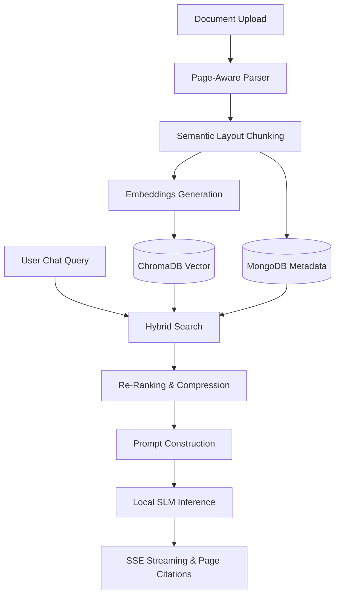

# Local AI Knowledge Studio - Architecture & RAG Workflow Guide

This guide provides a detailed technical explanation of the offline-first architecture, the index orchestration, and the Retrieval-Augmented Generation (RAG) workflow implemented in this project.

---

## 🏗️ 1. Architecture Design: SLM + RAG + PAG

This project implements a private workspace utilizing a combination of **Small Language Models (SLMs)**, **Retrieval-Augmented Generation (RAG)**, and **Page-Aware Generation (PAG)**.

### 🤖 SLM (Small Language Model)
Rather than relying on heavy, resource-intensive cloud LLMs, this project leverages local **Small Language Models (SLMs)** (under 4B parameters) running offline via Ollama. 
* **Models Used:** `llama3.2:latest` (3B) and `qwen2.5vl:3b`.
* **Latency Optimization:** Because SLMs run locally on consumer-grade hardware (CPU/GPU), latency is critical. We optimized this by setting the context window length (`num_ctx=4096` in [backend/rag/rag.py](file:///C:/Users/LeelaKota/OneDrive%20-%20ProductSquads%20Technolabs%20LLP/Desktop/RAG_CHATBOT/backend/rag/rag.py)) to minimize prompt prefill time, and instructing the model to generate extremely brief thought processes to speed up time-to-first-token.

### 🔍 RAG (Retrieval-Augmented Generation)
RAG ensures the local assistant answers questions using only your private document context, eliminating hallucinations. The project implements a **Hybrid Retrieval** system:
* **Lexical Keyword Search (BM25-like):** Queries exact word matches in MongoDB database indexes.
* **Vector Semantic Search:** Queries mathematical cosine similarities in ChromaDB vector store.
* **Re-Ranking & Fusion:** Combines search results using custom Reciprocal Rank Fusion (RRF), scoring them based on semantic distance, word match frequency, and page weight factors before feeding the top chunks to the SLM.

### 📄 PAG (Page-Aware Generation & Indexing)
Traditional RAG chunking mixes paragraphs together, losing document structure. **Page-Aware Generation (PAG)** solves this:
* **Page-Level Parsing:** During upload, [backend/parsers/parsers.py](file:///C:/Users/LeelaKota/OneDrive%20-%20ProductSquads%20Technolabs%20LLP/Desktop/RAG_CHATBOT/backend/parsers/parsers.py) extracts text page-by-page.
* **Metadata Tracking:** Each text chunk is tagged with its source `page_number` in MongoDB and ChromaDB.
* **Exact Citations:** The SLM reads these page numbers in its prompt context. In its response, it cites sources using bracketed indices (e.g. `[Source ID: 0]`). The frontend decodes this index to reveal the exact page number and text segment in a sliding preview drawer.

---

## 🔄 2. Step-by-Step RAG Chat Workflow

When you type a message in the Chat Assistant, the backend executes the following pipeline:

### Step 1: Input & Normalization
* The user's query is normalized (lowercased, excess whitespace stripped) inside [backend/retrieval/retrieval.py](file:///C:/Users/LeelaKota/OneDrive%20-%20ProductSquads%20Technolabs%20LLP/Desktop/RAG_CHATBOT/backend/retrieval/retrieval.py).
* Query language is auto-detected (English, Hindi, or Telugu) using character-range unicode checks.

### Step 2: Parallel Hybrid Retrieval
To maximize recall, the system triggers two search routines concurrently:
1. **Vector Semantic Search:** The query is embedded via `mxbai-embed-large` and matched against ChromaDB collections, filtering by `workspace_id`.
2. **Keyword Full-Text Search:** The query is expanded with local synonyms and matched against MongoDB text indexes.

### Step 3: Re-Ranking (RRF)
The candidate chunks retrieved from both databases (top 20 candidates each) are combined and evaluated:
$$\text{Score} = (0.5 \times \text{Semantic Cosine Similarity}) + (0.3 \times \text{Word Match Frequency}) + (0.2 \times \text{Page Target Boost})$$
The chunks are sorted and sliced to the top 5 most relevant elements.

### Step 4: Context Compression & Deduplication
* The system removes overlapping text and duplicate paragraphs from the top 5 chunks to keep the context clean and concise.

### Step 5: Prompt Construction
The system constructs a conversation context containing:
1. **System Prompt:** Rules specifying the formatting (e.g., `<think>` tags, general knowledge fallback, citation structure).
2. **Memory:** The last 8 messages of conversation history.
3. **Context Chunks:** The top retrieved text blocks, formatted with their `Source ID`, document name, and page number.
4. **User Input:** The latest question.

### Step 6: Streaming Inference & SSE Delivery
The backend connects to Ollama via LangChain's `ChatOllama` and streams response tokens using Server-Sent Events (SSE):
* **Reasoning Event (`event: reasoning`):** Delivers a short thought process detailing the referenced documents.
* **Message Event (`event: message`):** Delivers the main streamed answer.
* **Citations Event (`event: citations`):** Sends document names, IDs, and page numbers for the cited sources.
* **Metadata Event (`event: confidence`/`event: followups`):** Delivers confidence score metrics and follow-up prompts once generation concludes.

---

## 🤖 3. Models Configured

The application is powered by the following open-source models running locally on your machine via Ollama:

| Model | Size | Role | Description |
| :--- | :--- | :--- | :--- |
| **`llama3.2:latest`** | 3.0 Billion params | **Text Generation & RAG** | Core chat assistant model that synthesizes answers based on retrieved context. Highly optimized for CPU speed. |
| **`mxbai-embed-large:latest`**| 335 Million params | **Semantic Embedding** | Converts text chunks and search queries into 1024-dimension vector arrays. |
| **`qwen2.5vl:3b`** | 3.0 Billion params | **Vision Intelligence & OCR** | Handles vision-based QA in the chat (analyzing attached charts, charts, tables, and images). |
| **Tesseract OCR Engine** | Binary executable | **Optical Character Recognition** | Runs locally on the CPU to extract text from scanned images and picture PDFs. |

---

## 🛠️ 4. File Structure References
* [backend/main.py](file:///C:/Users/LeelaKota/OneDrive%20-%20ProductSquads%20Technolabs%20LLP/Desktop/RAG_CHATBOT/backend/main.py): Lifespan database checks, self-healing startup logic, and app routing.
* [backend/database/mongo.py](file:///C:/Users/LeelaKota/OneDrive%20-%20ProductSquads%20Technolabs%20LLP/Desktop/RAG_CHATBOT/backend/database/mongo.py): MongoDB asynchronous client connection with fast-fail timeouts.
* [backend/database/chroma.py](file:///C:/Users/LeelaKota/OneDrive%20-%20ProductSquads%20Technolabs%20LLP/Desktop/RAG_CHATBOT/backend/database/chroma.py): ChromaDB vector store client configuration with disabled telemetry.
* [backend/retrieval/retrieval.py](file:///C:/Users/LeelaKota/OneDrive%20-%20ProductSquads%20Technolabs%20LLP/Desktop/RAG_CHATBOT/backend/retrieval/retrieval.py): Hybrid search queries, Reciprocal Rank Fusion re-ranking, and query expansion.
* [backend/rag/rag.py](file:///C:/Users/LeelaKota/OneDrive%20-%20ProductSquads%20Technolabs%20LLP/Desktop/RAG_CHATBOT/backend/rag/rag.py): Chat memory retrieval, RAG system prompting, and token streaming.
* [backend/indexing/indexer.py](file:///C:/Users/LeelaKota/OneDrive%20-%20ProductSquads%20Technolabs%20LLP/Desktop/RAG_CHATBOT/backend/indexing/indexer.py): Semantic layout-aware chunking and document vector indexing.
